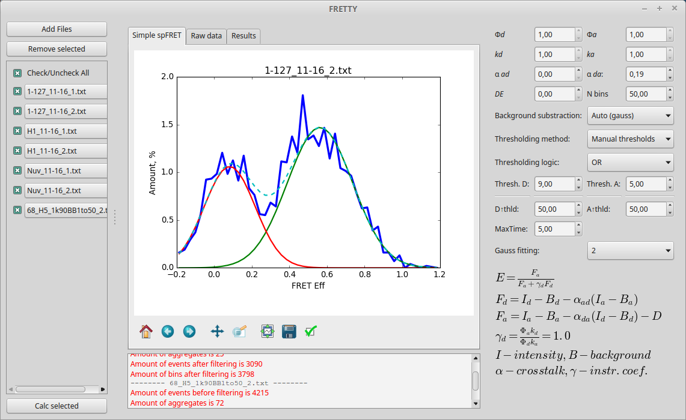

# fretty
This is a user friendly software for FRET calculation and comparing.

Features:
Works with time-binned data
Multiple Gauss fitting
Basic signal cleaning

Requires:
Python 2.7
PyQt4
Numpy
Scipy
Matplotlib
